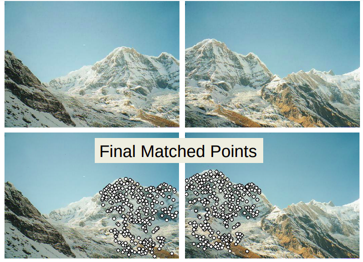
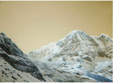
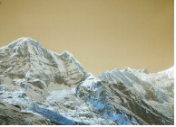
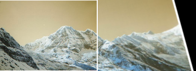
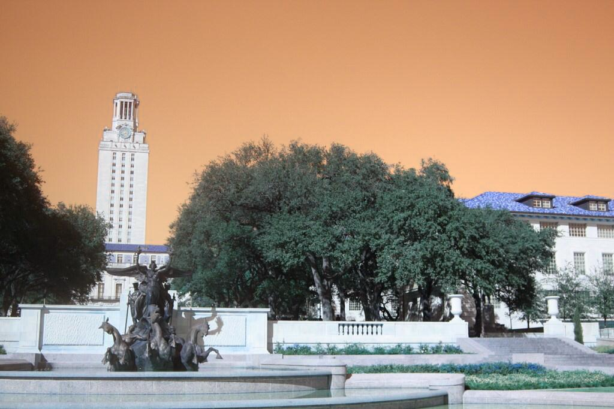
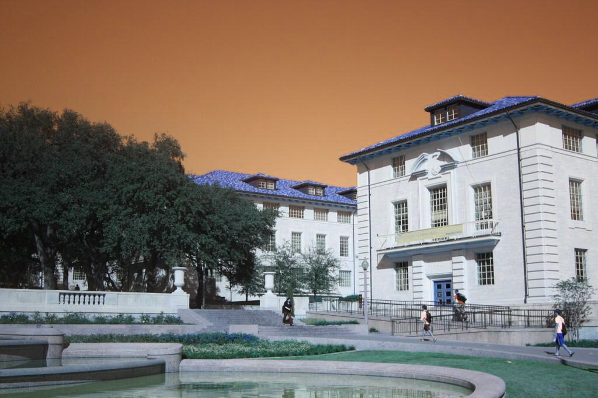
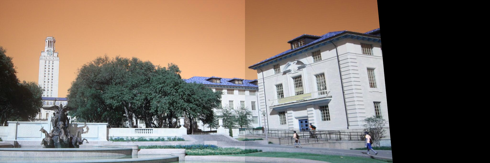

# image-stitching
Stitching 2 images to create a wide view
# Brief introduction 

* First we try to match points from both images.to do that we have to use scale invariant feature transform to descibe points.
This is due to the nature of warrping that might change the feature of the point.
* Then we deduce the homography matrix after finding matching point between both images.
* We proceed by warping the image so it can be "stitched" properly creating a panoramic/wide view 
<!--  -->
<!--  -->

  

# Example 1

  
  

  

# Example 2

  
  

  

# Extra resources and ref

* [illinois university lecture](https://courses.engr.illinois.edu/cs498dwh/fa2010/lectures/Lecture%2017%20-%20Photo%20Stitching.pdf)
